Bayesian A/B Testing
========================================================
author: Alex Yakubovich
date: July 9, 2014
transition: none

Frequentist A/B Testing
========================================================
- **P-value**: Probability of observing the result of a test (or a more extreme one) if there is no effect
- Probability of data given model

----

Problems
========================================================
- **No peeking**: unrealistic sample size requirements  
- Makes crude (but valid) approximations.
- Not all mistakes are created equal
- **Inflexible** and hard to interpert

Problems
========================================================
- **No peeking**: unrealistic sample size requirements  
- Makes crude (but valid) approximations.
- Not all mistakes are created equal
- **Inflexible** and hard to interpert

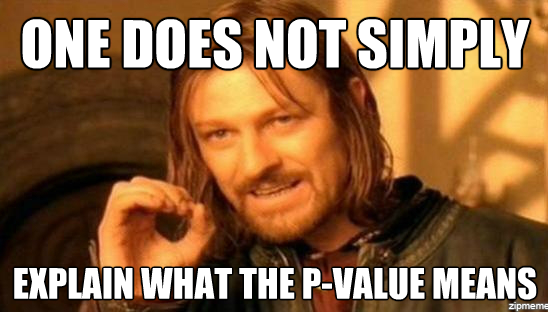

The Bayesian approach
========================================================
- Compute the **probability of the model given the data**
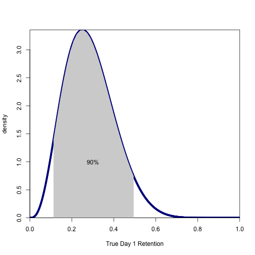 

Prior Distribution
========================================================
Beliefs about a random variable before seeing the data.
 

Beta Distribution
========================================================
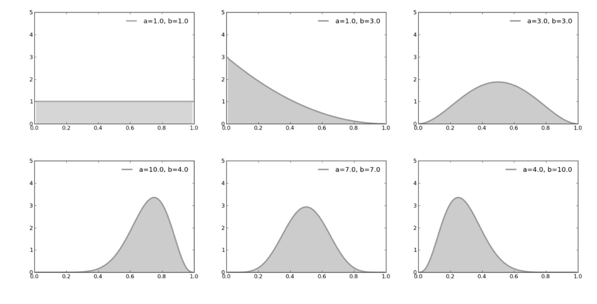

Likelihood Function
========================================================

Measures how likely it is that the data $D$ was generated by the model.
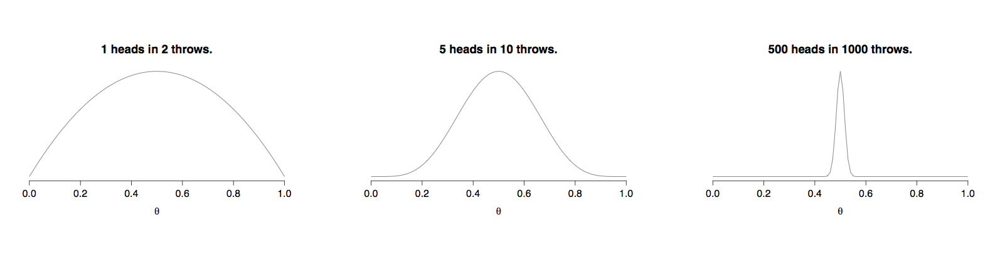

Bayes Rule
========================================================

Tells us how to update our beliefs after seeing the data.

$$ P(W | D) \propto P(D|W) \times P (W)$$

* $W =$ world state 
* $D =$ observed data

Updating our beliefs (n=0)
========================================================
 
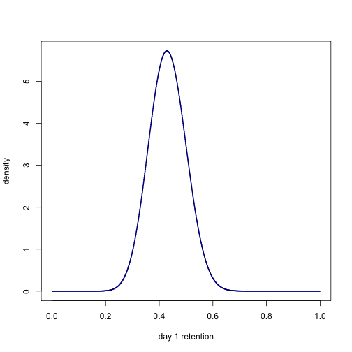 

Changing our beliefs (n=10)
========================================================
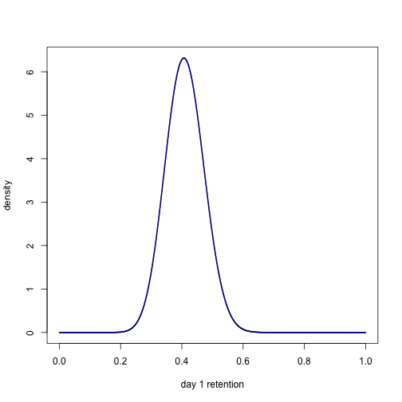 

Changing our beliefs (n=20)
========================================================
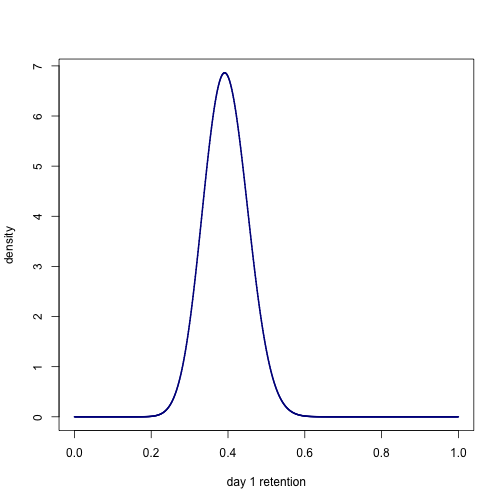 

Changing our beliefs (n=30)
========================================================
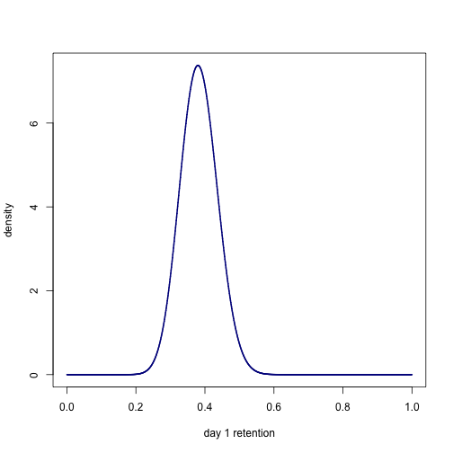 

Changing our beliefs (n=40)
========================================================
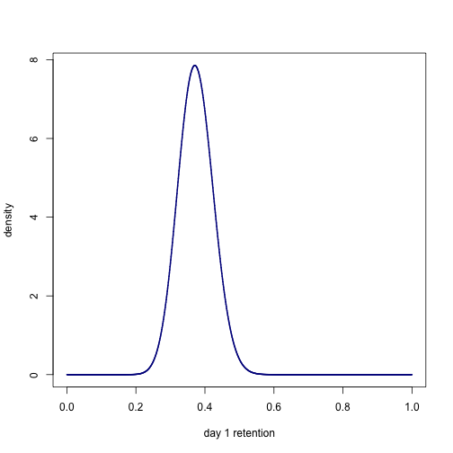 

Changing our beliefs (n=50)
========================================================
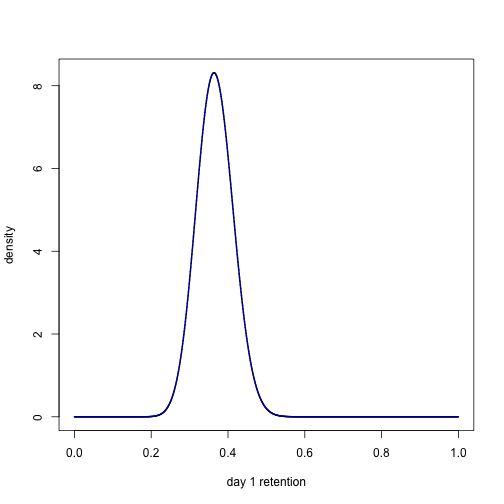 

Changing our beliefs (n=100)
========================================================
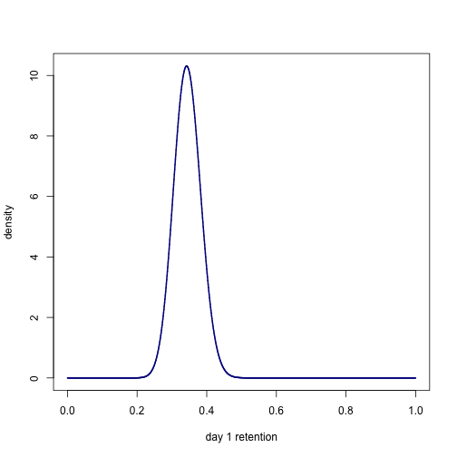 

Changing our beliefs (n=1000)
========================================================
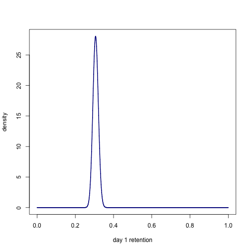 

Comparing two groups
========================================================

$$ \begin{align} \displaystyle P(\theta_B > \theta_A) &= \int \int_{\theta_B > \theta_A}P(\theta_A, \theta_B)  \\
 & = \int \int _{\theta_B > \theta_A} P(\theta_A | data) \times P(\theta_B | data) 
 \end{align}$$

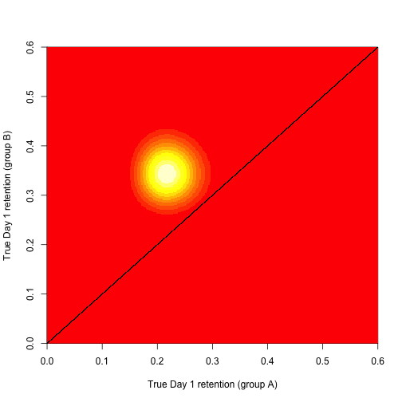 

 

When do we end a test?
========================================================

* **Risk:** How much many users/conversions/money do we expect we lose if we are wrong?
* Test is over as soon as the risk is below a threshold 

References
========================================================

- [Bayesian witch - Agile A/B Testing with Bayesian Statistics and Python](http://www.bayesianwitch.com/blog/2014/bayesian_ab_test.html)
- [Richrelevance - Bayesian A/B tests](http://engineering.richrelevance.com/bayesian-ab-tests/)
- [Richrelevance -  Bayesian analysis of Normal distributions with Python] (http://engineering.richrelevance.com/bayesian-analysis-of-normal-distributions-with-python/)
- [Richrelevance -  Bayesian A/B testing with a Lognormal model] (http://engineering.richrelevance.com/bayesian-ab-testing-with-a-log-normal-model/)
- [Swrve - A/B testing for game design iteration: a Bayesian approach] (http://www.gdcvault.com/play/1020201/A-B-Testing-for-Game)
- [Probabilistic Programming and Bayesian Methods for Hackers](http://camdavidsonpilon.github.io/Probabilistic-Programming-and-Bayesian-Methods-for-Hackers/)

